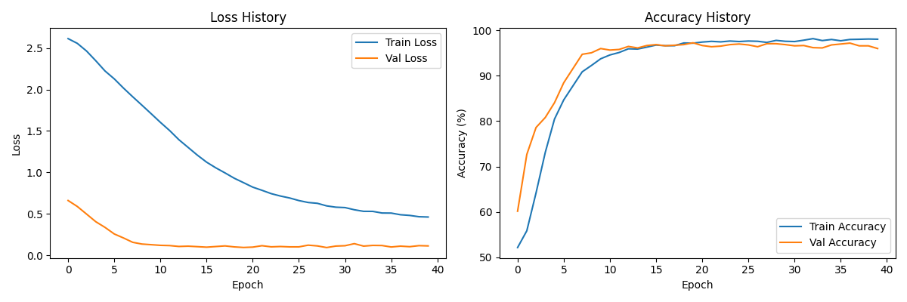
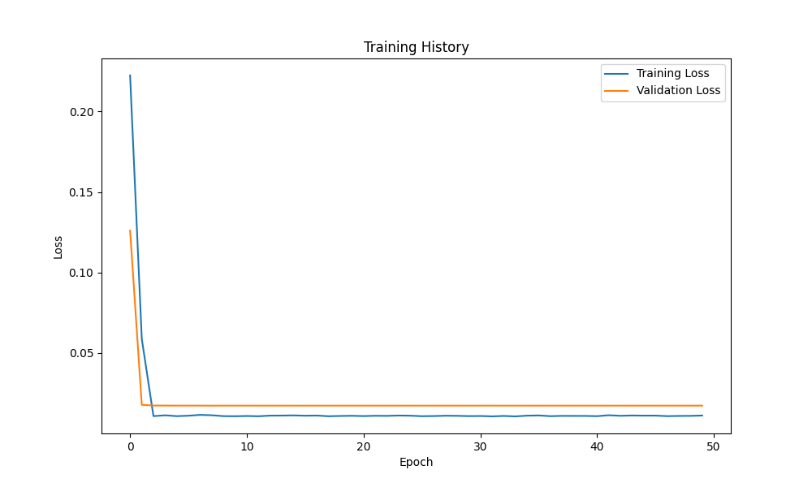
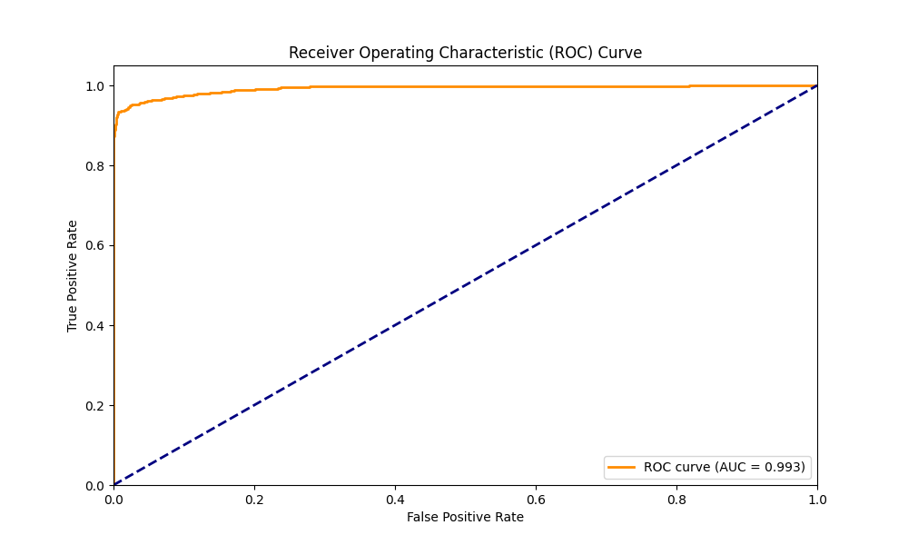
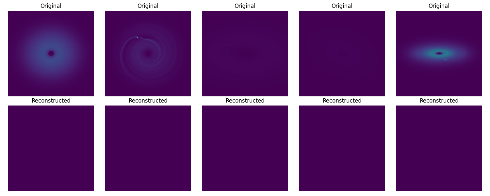
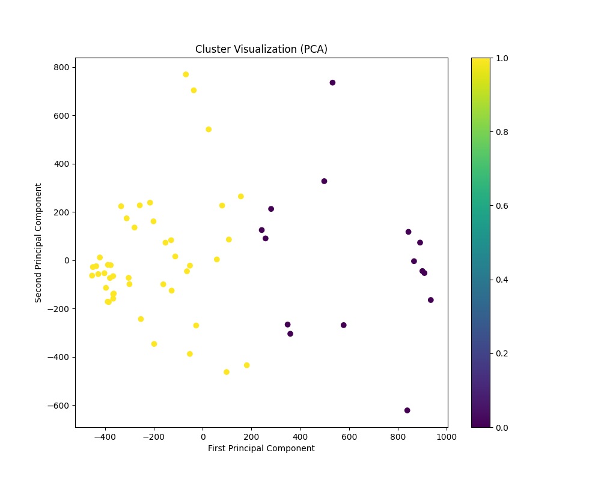

# EXXA GSoC 2025 Test Submission

## Overview
This submission implements three key components for the EXXA project:
1. Unsupervised Clustering (EXXA2)
2. Transit Curve Classifier (EXXA3)
3. Autoencoder (EXXA4)

## Results Summary

### Clustering (EXXA2)
- Best silhouette score: 0.433 with 2 clusters
- Data preprocessing: Removed 91 outliers, retained 7 components explaining 95% variance

### Transit Classifier (EXXA3)
- Test AUC: 0.993
- Test Average Precision: 0.994
- Validation Accuracy: 96.00%
- Training stopped at epoch 40 with early stopping

### Autoencoder (EXXA4)
- Final Training Loss: 0.0113
- Final Validation Loss: 0.0150

## Key Results

### 1. Training Progress


*Training progress showing convergence and validation performance*



*Autoencoder training progress showing loss reduction over epochs*

### 2. Model Performance



*The classifier achieved excellent performance with AUC of 0.993 and Average Precision of 0.994*

### 3. Autoencoder Results


*Original vs reconstructed images demonstrating the autoencoder's performance*

### 4. Clustering Visualization


*PCA visualization showing the effectiveness of our clustering approach*

## Dependencies
- Python 3.x
- PyTorch
- NumPy
- Matplotlib
- scikit-learn
- astropy
- pytorch_msssim

## Usage
1. Run the main script:
```bash
python exxatest.py
```

## Implementation Details

### Clustering (EXXA2)
- Implemented KMeans clustering
- Used silhouette score for evaluation
- Preprocessing includes outlier removal and PCA
- Visualizations include PCA plots and cluster examples

### Transit Classifier (EXXA3)
- Attention-based neural network
- BCEWithLogitsLoss for training
- Early stopping with patience=5
- Comprehensive evaluation metrics

### Autoencoder (EXXA4)
- Convolutional autoencoder architecture
- MSE loss for training
- Latent space visualization
- Reconstruction quality assessment
